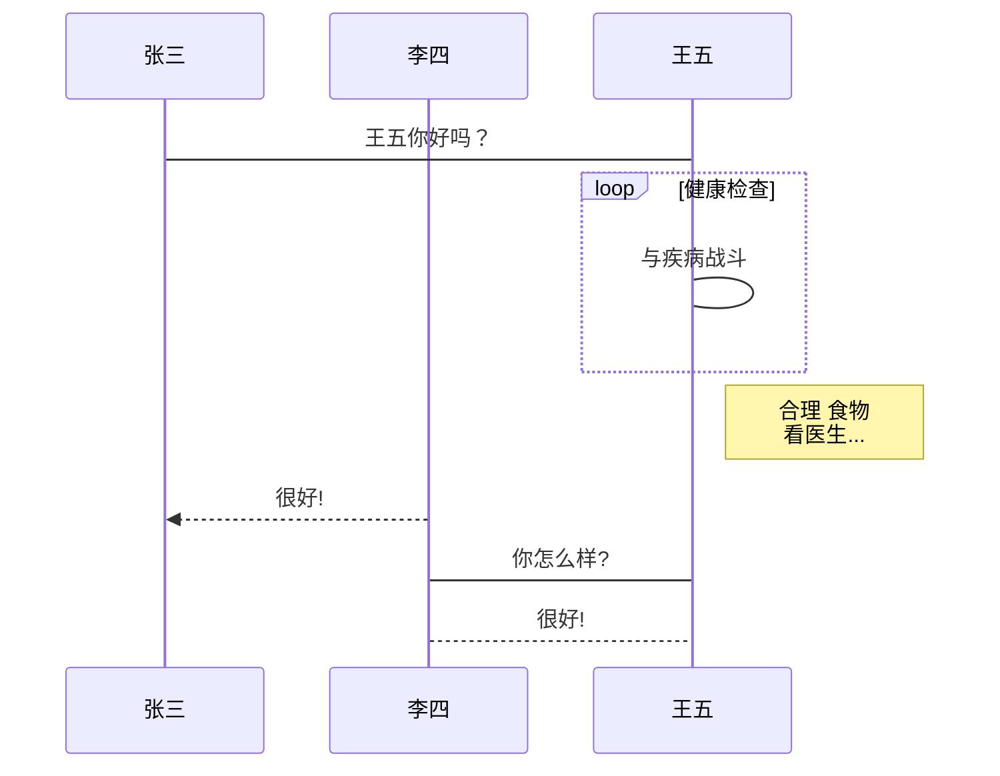

# 下面是两个教程
## 一、Jekyll Blog
## 二、Flask Blog


这是一个链接 [菜鸟教程](https://www.runoob.com)



```flow
st=>start: 开始框
op=>operation: 处理框
cond=>condition: 判断框(是或否?)
sub1=>subroutine: 子流程
io=>inputoutput: 输入输出框
e=>end: 结束框
st(right)->op(right)->cond
cond(yes)->io(bottom)->e
cond(no)->sub1(right)->op
```
